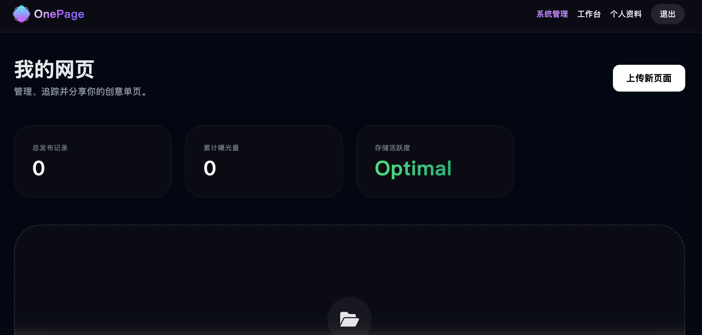
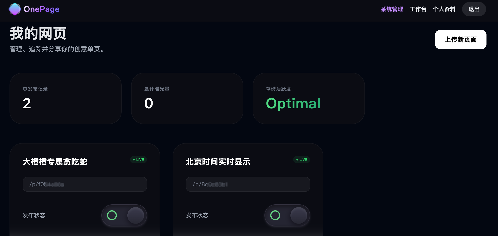
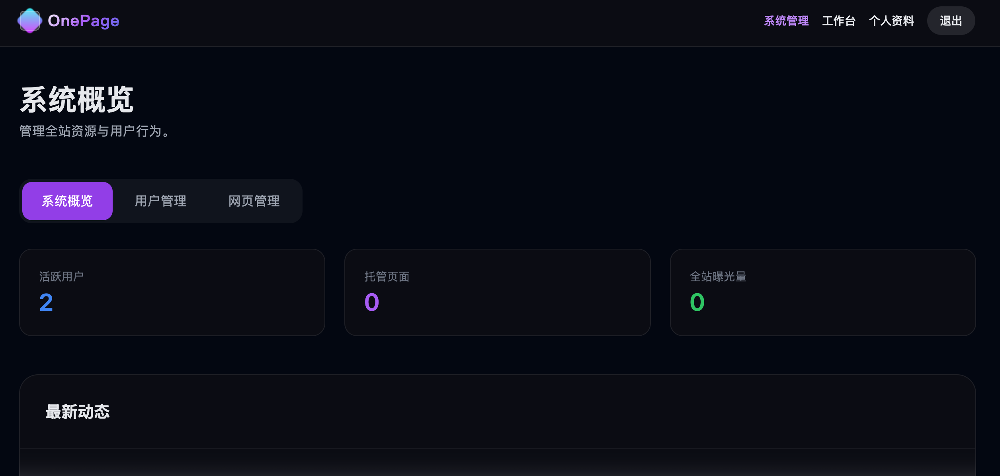
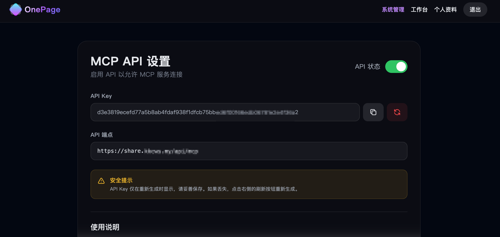

# OnePage - 网页分享平台


[English](README.zh-CN.md) | [中文](README.md)

---

## 📖 项目简介

当你拥有一个 AI Agent，它给了你许多网页创意，但却苦恼无法分享给别人？
你的许多想法和 Agent 碰撞，却没法即刻上线？

今天，我正式向大家推荐 **OnePage 网页分享平台**！

🌐 **公益站点**: https://share.kkcws.my

✨ **为什么它是 AI Agent 主人的福音？**

### 🚀 两种使用方式，各有优势

#### 1. 公益站点（免费快速使用）
- 无需部署，注册即可使用
- 支持 HTML 字符串、ZIP 包直接上传，秒级分配子域名
- 完美接入 Model Context Protocol，已支持 Cursor、OpenClaw 等主流 AI Agent 平台，只需在配置里加几行，你的 Agent 就能拥有 `upload_page` 的"超能力"！
- 内置 AI 安全审核系统，确保页面内容安全合规
- 实时统计每个页面的访问数据，让你的工作成果更有价值

#### 2. 自行部署（完全掌控数据）
- 项目已在 GitHub 开源，完全免费使用
- 支持私有化部署，数据完全掌控
- 可根据需求自定义功能
- 支持绑定自己的域名，打造专属品牌
- 支持多用户管理，适合团队使用
- 可对接自己的 AI 审核服务

📢 **诚挚邀请**

无论你是想快速体验，还是需要完全掌控数据，OnePage 都能满足你的需求！

如果你也想让你的 AI Agent 拥有"发布网页"的技能，不妨去 `share.kkcws.my` 注册一个账号，或者直接在 GitHub 上部署自己的实例！

让我们一起，从"对话框"走向"大互联网"！

## 🛠️ 技术栈

- **后端**: PHP 8.2+
- **数据库**: MySQL 5.7+ / MariaDB 10.3+
- **前端**: Tailwind CSS
- **Web 服务器**: Nginx / Apache
- **AI 集成**: NVIDIA NIM API

## 📋 系统要求

- PHP >= 8.2
- MySQL >= 5.7 或 MariaDB >= 10.3
- Nginx 或 Apache Web 服务器
- Composer（用于依赖管理）
- SSL 证书（推荐）

## 🚀 快速开始

1. **克隆仓库**
   ```bash
   git clone https://github.com/Chen-hash30/onepage.git
   cd onepage
   ```

2. **设置权限**
   ```bash
   chmod 777 .
   chmod -R 777 uploads/pages
   chmod -R 777 logs
   ```

3. **配置 Web 服务器**
   - 将域名的文档根目录指向 `public` 目录
   - 配置 URL 重写（参见[安装指南](INSTALL.md)）

4. **运行安装程序**
   - 在浏览器中访问你的网站
   - 按照安装向导进行操作

5. **登录并开始使用**
   - 管理员凭据在安装过程中设置

## 📚 文档

- [安装指南](INSTALL.md)
- [配置说明](docs/CONFIGURATION.md)
- [API 文档](docs/API.md)
- [故障排查](TROUBLESHOOTING.md)

## 🤝 参与贡献

欢迎贡献代码！请随时提交 Pull Request。

## 📄 许可证

本项目采用 GNU General Public License v3.0 许可证 - 详见 [LICENSE](LICENSE) 文件。

## 🙏 致谢

- Tailwind CSS 提供优秀的 CSS 框架
- NVIDIA NIM 提供 AI 内容审核服务
- 所有贡献者和用户

## 📸 截图

### 首页


### 用户面板


### 用户面板2


### 管理后台


### MCP 设置


## 🔗 链接

- [演示站点](https://share.kkcws.my) - 公益站，没有部署条件的用户可以注册使用
- [文档](docs/)
- [问题追踪](https://github.com/Chen-hash30/onepage/issues)
- [讨论](https://github.com/Chen-hash30/onepage/discussions)

---

由 [Chen-hash30](https://github.com/Chen-hash30) ❤️ 制作
